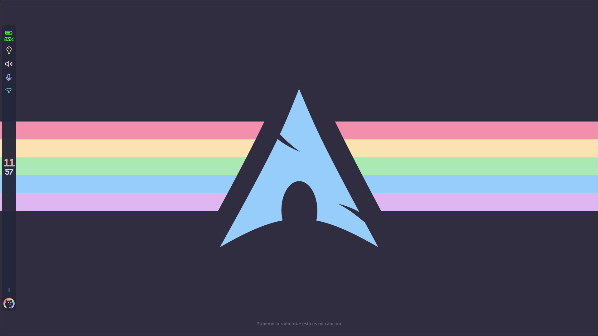
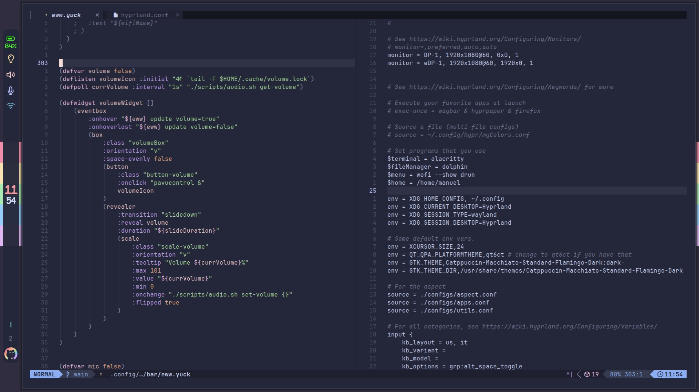
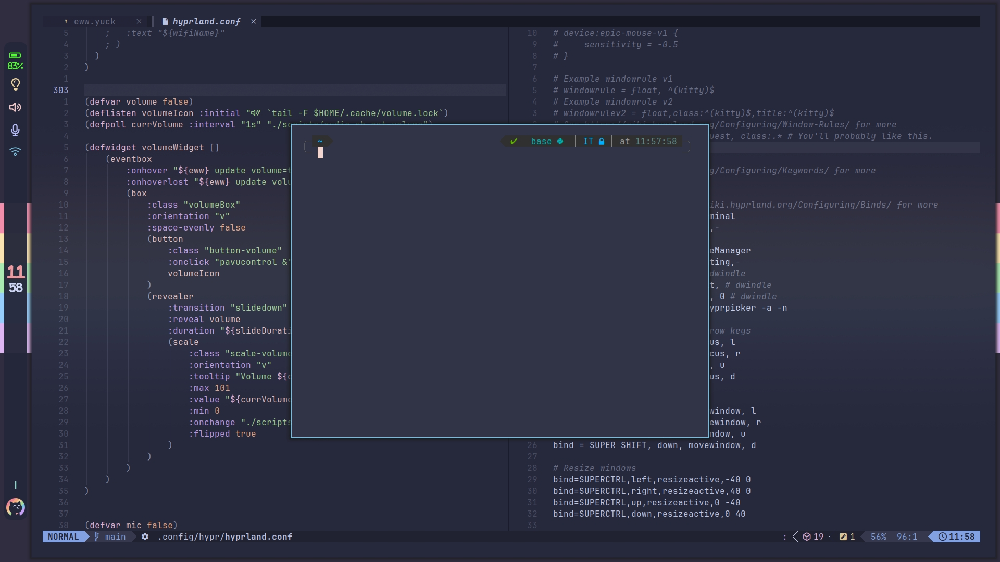

# Gallery

<br>

<br>

<br>

# Installation

Dotfiles are managed with [chezmoi](https://www.chezmoi.io/). The repo itself is the
chezmoi source directory (`~/.dotfiles`).

```bash
# first machine (this repo)
sudo pacman -S chezmoi
mkdir -p ~/.config/chezmoi
cat > ~/.config/chezmoi/chezmoi.toml <<'EOF'
sourceDir = "~/.dotfiles"
EOF
chezmoi init && chezmoi apply
```

On a new machine:
```bash
chezmoi init --apply git@github.com:manueldiagostino/.dotfiles.git
```
then set `sourceDir = "~/.dotfiles"` in `~/.config/chezmoi/chezmoi.toml` if you
prefer the source to live there.

Per-machine options (`wm`: hyprland/niri/caelestia, `theme`: mocha/macchiato) are
set in `~/.config/chezmoi/chezmoi.toml` under `[data]`, or re-prompted with
`chezmoi init`. Files for other window managers/themes are excluded via
`.chezmoiignore`.

Theme and icons have to be set manually with `qt5ct`. 


## Dependencies

> The list may be incomplete!

```bash
sudo pacman -S \
sddm openssh \
alacritty \
vi neovim \
cliphist \
dunst \
wofi \
jre-openjdk jdk-openjdk npm nodejs \
zathura zathura-pdf-poppler \
okular \
texlive biber texlive-lang \
kvantum qt5ct \
awk brightnessctl pamixer \
cmake hyprlang hyprpaper \
hypridle hyprlock \
slurp jq imv \
ttf-font-awesome \
zoxide 

# optional
yay -S \
wluma \
wayshot \
eww
```

## [SDDM](https://wiki.archlinux.org/title/SDDM)
Insert this lines into `/etc/sddm.conf.d/default.conf`:
```bash
[Theme]
	Current=catppuccin-macchiato
```

## [ssh-agent](https://wiki.archlinux.org/title/SSH_keys)
Once installed `openssh` you need to
```bash
systemctl --user enable ssh-agent.service
systemctl --user start ssh-agent.service
```

The following is already given in `.zshrc`:
```bash
# ssh-agent
export SSH_AUTH_SOCK="$XDG_RUNTIME_DIR/ssh-agent.socket"
```

## Awesome font
```bash
sudo pacman -S otf-font-awesome
```

## [Idle management](https://github.com/hyprwm/hypridle)

## Lock screen

## TODO
- [ ] copiare screenshots negli appunti
